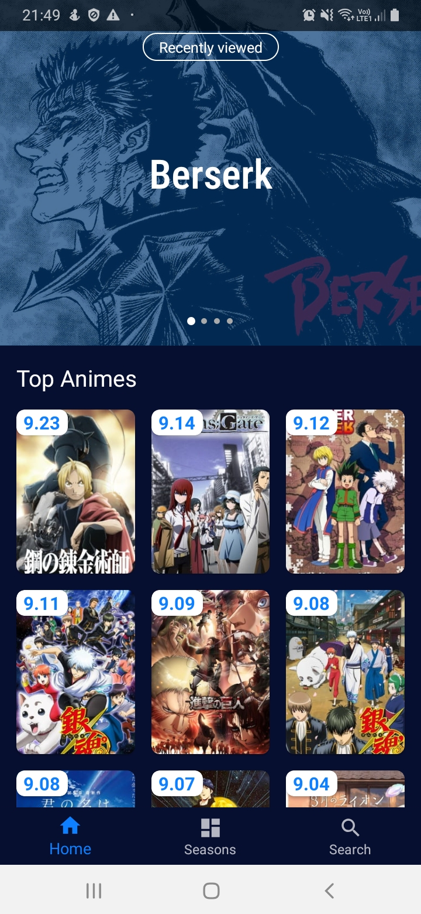
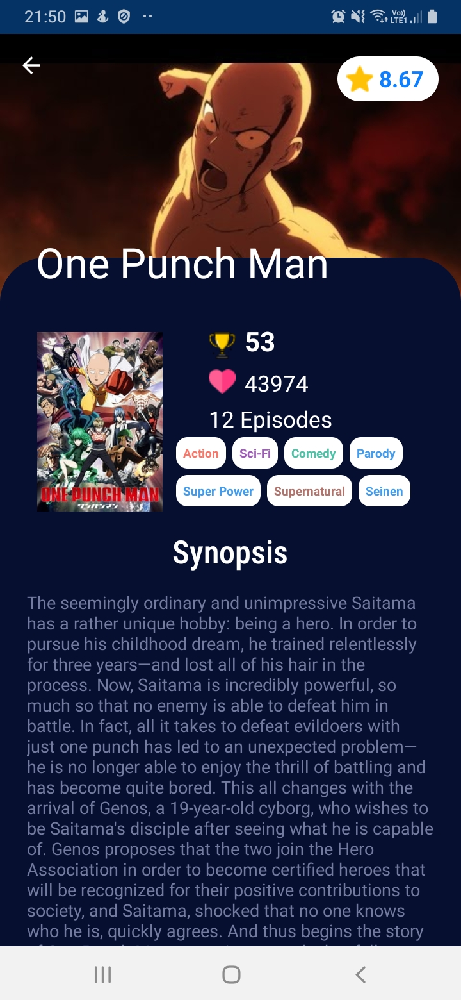
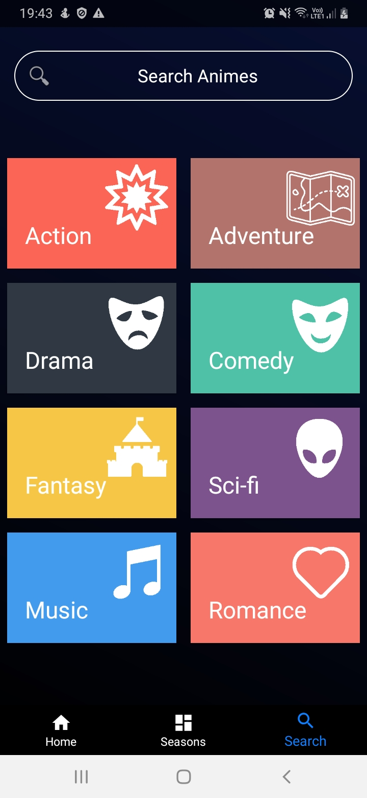
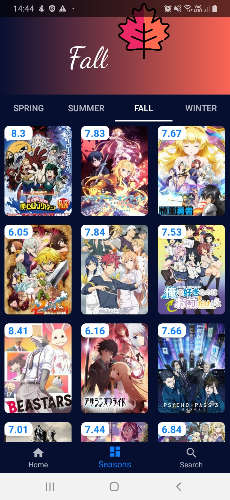

<h1 align="center">
    Android Anime List
</h1>

    Aplicativo android em Kotlin com MVVM para listar as tendências de animes.

## Screenshots

  
  
    

  
  

- [Kotlin](https://kotlinlang.org/)
- [LiveData](https://developer.android.com/topic/libraries/architecture/livedata)
- [Navigation](https://developer.android.com/topic/libraries/architecture/navigation)
- [ViewModel](https://developer.android.com/topic/libraries/architecture/viewmodel)
- [Retrofit](https://square.github.io/retrofit/)
- [MotionLayout](https://developer.android.com/training/constraint-layout/motionlayout)
- [Databinding](https://developer.android.com/topic/libraries/data-binding)

## To DO

- Room
- Koin
- JUnit
- Robolectric
- Espresso

## Design

- [Streaming App (Dark Mode)](https://dribbble.com/shots/5886795-UI-Streaming-App-Dark-Mode) criado por [Stefan Kristian Spassov](https://dribbble.com/stefanspassov)

## API

- [jikan.moe API](https://jikan.moe/)

## ICONES

- [flaticon](https://www.flaticon.com/)